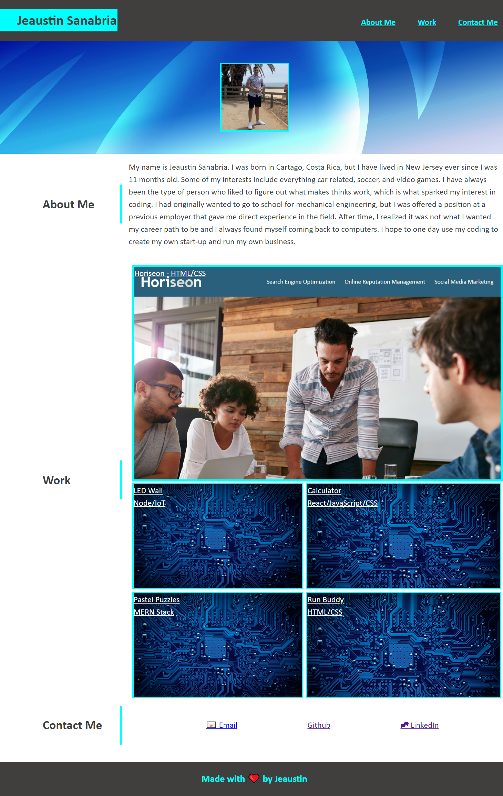

# Portfolio

## Description

This portfolio is a brief description of me and its purpose is to showcase my skills as a full-stack web developer. Recent projects will be listed under the "Work" category. You can get in contact with me on the different platforms listed in the "Contact Me" category.

## Screenshots
Portfolio Screenshot

## 🔗 Project-Links
- [Deployed Applocation](N/A)
- [GitHub Repo](https://github.com/jeaustins27/Jeaustin-Portfolio)

## Credits

- [W3 Schools](https://www.w3schools.com/)
- [ReadME.so](https://readme.so)

## License

[MIT](https://choosealicense.com/licenses/mit/)

